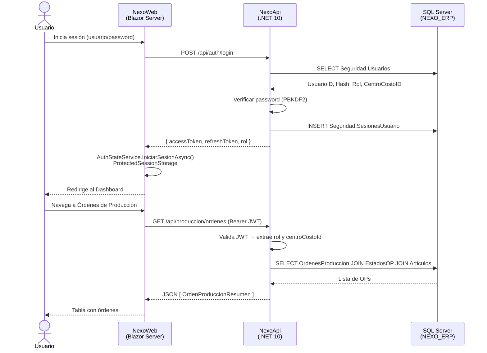

# Arquitectura del Sistema NEXO ERP

## 1. Visión General

NEXO ERP está construido en tres capas bien diferenciadas que se comunican de forma unidireccional:

```
┌─────────────────────────────────────────────────────────────┐
│                    Capa de Datos                             │
│   SQL Server (DESKTOP-V83PQ7M\JONATHAN / NEXO_ERP)          │
│   Tablas · Vistas · Stored Procedures · Funciones           │
└────────────────────────┬────────────────────────────────────┘
                         │ Dapper + SQL raw (sin ORM)
                         │ Microsoft.Data.SqlClient
┌────────────────────────▼────────────────────────────────────┐
│                    Capa de Negocio / API                     │
│   NexoApi — .NET 10 ASP.NET Core Web API                    │
│   JWT Bearer · ApiKey · ExceptionHandlingMiddleware          │
│   Features: Auth, Catalogo, Produccion, Inventario ...      │
└───────────────┬─────────────────────────────────────────────┘
                │ HTTP + JSON (Bearer token)
                │ HttpClient tipado (NexoApiClient)
┌───────────────▼─────────────────────────────────────────────┐
│                    Capa de Presentación                       │
│   NexoWeb — .NET 10 Blazor Server                           │
│   MudBlazor 7.15 · ProtectedSessionStorage · SignalR        │
│   Páginas, Diálogos, NavMenu, Tema Grafito+Beige            │
└─────────────────────────────────────────────────────────────┘

Componente paralelo:
┌─────────────────────────────────────────────────────────────┐
│   NexoSyncAgent — .NET 10 Worker Service                    │
│   Sincroniza NEXO ↔ Visions ERP (sistema externo)           │
│   Auth: X-Api-Key sobre HTTPS hacia NexoApi                 │
└─────────────────────────────────────────────────────────────┘
```

---

## 2. Diagrama de Flujo Principal



---

## 3. Responsabilidades por Proyecto

### NexoApi

**Es**: el único punto de contacto con la base de datos. Toda la lógica de negocio vive aquí.

**No hace**: renderizado de UI, manipulación de estado del navegador.

Responsabilidades:
- Autenticación y emisión de JWT
- Validación de roles en cada endpoint
- Traducción de errores SQL a HTTP status codes
- Abstracción del modelo de datos (mapeo SQL → C# records)
- Ejecución de stored procedures para operaciones transaccionales
- Exposición de endpoints REST para cada módulo de negocio

### NexoWeb

**Es**: una interfaz de usuario reactiva. Nunca accede a la BD directamente.

**No hace**: validaciones de negocio, acceso a datos, lógica transaccional.

Responsabilidades:
- Renderizar la UI con MudBlazor
- Gestionar la sesión del usuario en memoria y en `ProtectedSessionStorage`
- Invocar `NexoApiClient` para todas las operaciones
- Controlar la visibilidad de elementos según el rol del usuario
- Mostrar notificaciones y confirmar operaciones destructivas

### NexoSyncAgent

**Es**: un worker autónomo que sincroniza inventario entre NEXO y Visions.

Responsabilidades:
- Leer `Integracion.EventosSalientes` pendientes via API y enviarlos a Visions
- Recibir eventos de ventas de Visions y registrarlos en `Integracion.EventosEntrantes`
- Procesar eventos entrantes invocando `Integracion.sp_ProcesarEventoEntrante`

---

## 4. Organización Interna de NexoApi — Feature Slices

Cada módulo de negocio es un "slice" independiente:

```
Features/
└── Produccion/
    ├── Dtos/
    │   └── OrdenProduccionDtos.cs    ← todos los records del módulo
    ├── OrdenesProduccionService.cs   ← interface + implementación (mismo archivo)
    └── OrdenesProduccionController.cs ← [ApiController] [Route] [Authorize]
```

**Regla**: un módulo no importa clases de otro módulo (excepto DTOs de Catálogo que son compartidos entre varios módulos).

### Registro en Program.cs

```csharp
// Infraestructura (Singleton — una conexión factory para toda la app)
builder.Services.AddSingleton<IDbConnectionFactory, SqlConnectionFactory>();

// Servicios de negocio (Scoped — uno por request HTTP)
builder.Services.AddScoped<IOrdenesProduccionService, OrdenesProduccionService>();
builder.Services.AddScoped<IInventarioService, InventarioService>();
// ... resto de módulos
```

---

## 5. Organización Interna de NexoWeb

### Flujo de autenticación en el cliente

```
Program.cs registra:
  - AuthStateService (Scoped) — estado de sesión en memoria
  - CustomAuthStateProvider (Scoped) — provee el ClaimsPrincipal a Blazor
  - NexoApiClient (Scoped via HttpClient) — cliente HTTP tipado

Al montar el circuito (InicializadorSesion.razor):
  → AuthStateService.InicializarAsync()
  → Lee ProtectedSessionStorage["nexo_sesion"]
  → Si existe, restaura Token, Nombre, Rol, CentroCostoId
  → NotifyAuthenticationStateChanged()
  → AuthorizeView / NavMenu se actualizan

En cada request HTTP (NexoApiClient):
  → AgregarTokenAsync() → agrega "Authorization: Bearer {token}"
  → Si respuesta 401 → CerrarSesionAsync() + redirect a /login
  → Si error → leer { "error": "..." } y lanzar HttpRequestException
```

### Comunicación de estado entre componentes

No hay state management global (Flux/Redux). El estado local está en cada componente. Para comunicación entre página y diálogo se usa `DialogResult.Ok(dato)`.

---

## 6. Seguridad

### Autenticación de usuarios (JWT)

- Algoritmo: HMAC-SHA256
- Emisor: `NexoApi` | Audiencia: `NexoClients`
- Expiración: 60 minutos (access token), 7 días (refresh token)
- Claims: `sub` (UsuarioID), `unique_name` (username), `role`, `CentroCostoId`
- Clave en `appsettings.json["Jwt:Key"]`

### Autenticación de NexoSyncAgent (ApiKey)

- Header: `X-Api-Key: {clave-raw}`
- Se hace SHA256 de la clave y se compara con `Integracion.AgentesSync.ApiKeyHash`
- Claim resultante: `CentroCostoId` del agente
- Al autenticarse: actualiza `UltimaConexion` en la BD

### Hashing de contraseñas

- Clase `PasswordHasher` (custom, archivo `Common/Security/PasswordHasher.cs`)
- Usa `PBKDF2` con salt aleatorio
- Almacena `varbinary(256)` (hash) y `varbinary(128)` (salt) en `Seguridad.Usuarios`

---

## 7. Dependencias entre Proyectos

```
NexoApi
  ├── Dapper 2.1.79
  ├── Microsoft.Data.SqlClient 7.0.2
  ├── Microsoft.AspNetCore.Authentication.JwtBearer 10.0.10
  ├── System.IdentityModel.Tokens.Jwt 8.22.0
  ├── Microsoft.OpenApi 1.6.22
  └── Swashbuckle.AspNetCore 6.6.2

NexoWeb
  └── MudBlazor 7.15.0
      (MudBlazor incluye todo lo de MudBlazor internamente; no hay más packages)

NexoSyncAgent
  ├── Microsoft.Data.SqlClient (para Visions)
  └── HttpClient hacia NexoApi
```

---

## 8. Módulos y sus Endpoints

### Auth (`/api/auth`)

| Método | Ruta | Rol | Descripción |
|---|---|---|---|
| POST | `/registrar` | Público (solo si no hay usuarios) | Crea el primer admin |
| POST | `/login` | Público | Login, devuelve JWT |
| GET | `/usuarios` | Administrador | Lista usuarios |
| POST | `/usuarios` | Administrador | Crea usuario |
| PUT | `/usuarios/{id}` | Administrador | Actualiza usuario |
| POST | `/usuarios/{id}/resetear-password` | Administrador | Resetea contraseña |
| GET | `/roles` | Administrador | Lista roles activos |

### Catálogo (`/api/catalogo`)

| Método | Ruta | Rol | Descripción |
|---|---|---|---|
| GET | `/articulos` | Autenticado | Lista artículos (filtro: tipoArticuloId) |
| POST | `/articulos` | Administrador | Crea artículo |
| PUT | `/articulos/{id}` | Administrador | Actualiza artículo |
| GET | `/tipos-articulo` | Autenticado | Lista tipos de artículo |
| GET | `/unidades-medida` | Autenticado | Lista unidades |
| GET | `/bodegas` | Autenticado | Lista bodegas |
| POST | `/bodegas` | Administrador | Crea bodega |
| GET | `/centros-costo` | Autenticado | Lista centros de costo |
| POST | `/centros-costo` | Administrador | Crea centro de costo |
| PUT | `/centros-costo/{id}` | Administrador | Actualiza centro de costo |
| GET | `/clientes` | Autenticado | Lista clientes |
| POST | `/clientes` | Administrador | Crea cliente |
| PUT | `/clientes/{id}` | Administrador | Actualiza cliente |
| GET | `/proveedores` | Autenticado | Lista proveedores |
| POST | `/proveedores` | Administrador | Crea proveedor |
| PUT | `/proveedores/{id}` | Administrador | Actualiza proveedor |
| GET | `/centros-trabajo` | Autenticado | Lista centros de trabajo |

### Producción (`/api/produccion`)

| Método | Ruta | Rol | Descripción |
|---|---|---|---|
| GET | `/ordenes` | Autenticado | Lista OPs (filtro: centroCostoId, estado) |
| POST | `/ordenes` | Admin, Supervisor | Crea OP |
| GET | `/ordenes/{id}` | Autenticado | Detalle de OP |
| POST | `/ordenes/{id}/liberar` | Admin, Supervisor | Libera OP (Planificada→Liberada) |
| POST | `/ordenes/{id}/iniciar` | Admin, Supervisor, Operario | Inicia OP (→En Proceso) |
| POST | `/ordenes/{id}/cerrar` | Admin, Supervisor | Cierra OP (→Finalizada) |
| GET | `/ordenes/{id}/consumos` | Autenticado | Lista consumos de MP de la OP |
| PATCH | `/ordenes/consumo/{consumoId}` | Admin, Supervisor | Ajusta cantidad real consumida |
| GET | `/ordenes/motivos-exceso` | Autenticado | Lista motivos de exceso de consumo |
| GET | `/ordenes/tipos-produccion` | Autenticado | Lista tipos de producción |
| GET | `/recetas` | Admin, Supervisor | Lista recetas BOM |
| POST | `/recetas` | Admin, Supervisor | Crea receta |
| GET | `/recetas/{id}` | Admin, Supervisor | Detalle de receta con líneas |

### Inventario (`/api/inventario`)

| Método | Ruta | Rol | Descripción |
|---|---|---|---|
| GET | `/stock` | Autenticado | Stock consolidado (filtros varios) |
| GET | `/kardex` | Admin, Supervisor, Bodeguero | Kardex de movimientos (TOP 500) |
| GET | `/motivos-perdida` | Admin, Bodeguero | Lista motivos de baja |
| POST | `/bajas` | Admin, Bodeguero | Registra baja de inventario |
| GET | `/traspasos` | Admin, Bodeguero | Lista traspasos |
| POST | `/traspasos` | Admin, Bodeguero | Crea traspaso |
| POST | `/traspasos/{id}/recibir` | Admin, Bodeguero | Recibe traspaso |

### Compras (`/api/compras`)

| Método | Ruta | Rol | Descripción |
|---|---|---|---|
| GET | `/ordenes` | Admin, Bodeguero | Lista OCs |
| POST | `/ordenes` | Admin, Bodeguero | Crea OC |
| POST | `/ordenes/{id}/recibir-linea` | Admin, Bodeguero | Recibe una línea de OC |

### Dashboard (`/api/dashboard`)

| Método | Ruta | Descripción |
|---|---|---|
| GET | `/plan-vs-real?dias=14` | Serie planificado vs real |
| GET | `/distribucion-centro-costo` | Distribución de producción por CC |
| GET | `/perdidas-por-motivo?dias=30` | Pérdidas agrupadas por motivo |
| GET | `/tendencia-costo?articuloId=X` | Tendencia de costo unitario por producto |
| GET | `/cumplimiento-planificacion` | % cumplimiento por centro de costo |

---

## 9. Ciclo de Vida de una Orden de Producción

```
              ┌─────────────┐
              │  Planificada │  (estado inicial al crear)
              └──────┬──────┘
                     │ sp_LiberarOrdenProduccion
                     │ • Valida stock de MP
                     │ • Reserva cantidades teóricas
                     ▼
              ┌─────────────┐
              │   Liberada   │
              └──────┬──────┘
                     │ sp_IniciarOrdenProduccion
                     │ • Descuenta stock de MP del inventario
                     │ • Registra movimientos en Kardex (salida)
                     │ • Crea registros en OrdenesProduccionConsumo
                     ▼
              ┌─────────────┐
              │  En Proceso  │  ← Ajuste de consumo disponible (PATCH)
              └──────┬──────┘
                     │ sp_CerrarOrdenProduccion
                     │ • Calcula costo real (materiales + MOD + CIF)
                     │ • Ingresa PT al inventario (Kardex entrada)
                     │ • Crea lote de PT
                     │ • Genera evento saliente para Visions
                     ▼
              ┌─────────────┐
              │  Finalizada  │
              └─────────────┘
```
